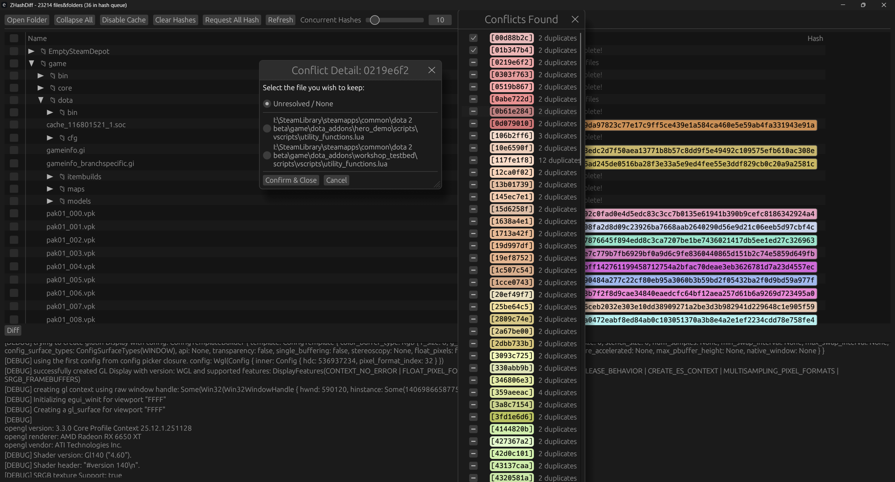

# ZHashDiff

I need to resolve and delete duplicated files with different file names.

Good reference & aim for this project: https://www.scootersoftware.com/

## TODO (probably stale):
* Text file content diffing
* Text file diffing viewer
* image file comparison
* user defined comparison per file format
* Fix file watcher or limit update on reading fs
* Fix hitch for recursive checkbox check

# Duplicate file diff:
* conflicts found window, highlight current selection
* Allow restoring of resolved files (maybe mark file names as red?)