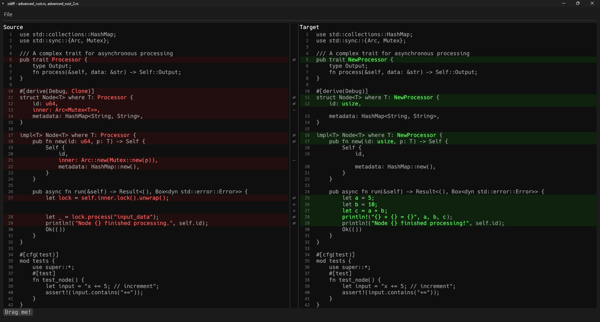

# ZDiff-GUI

GUI for zdiff crate

# Featuers
* Myers diffing
* Keybindings
* Powerful diffing view
    - Next conflict
    - Search for text
    - Goto line
    - Line Pivot
    - Lexer modes
    - P4 Integration
    - Diff Options
        + Ignore whitespace
        + Highlight rows that differ
        + Inline ghost tokens
        + Syntax highlight (only hardcoded keywords for now)

## Known bugs
* lost_focus not called correctly on paths when holding down mouse: https://github.com/emilk/egui/issues/2142

## Todo
* Add ZDiff-GUI images to front .readme
* Add platform image for .exe

* Syncronized scroll bar (like p4)
* Batch DiffRow performance optimzation
* Quick Diff /w multiple p4 repositories
* Show diffs only Diff Option

* user defined comparison per file format
* better horizontal scrolling
* show time it took to compute the diff