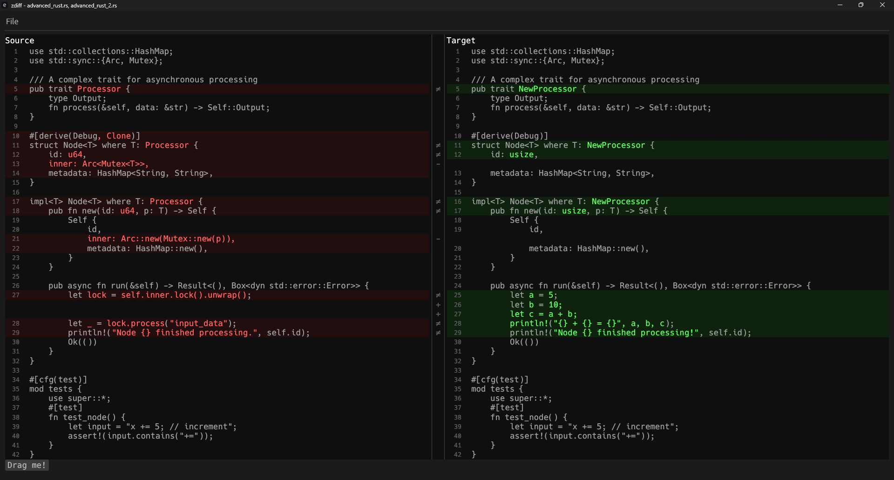

# ZDiff-GUI

GUI for zdiff crate

# Featuers
* Myers diffing
    - Linear version
    - Linear MT version
* Keybindings
    - Customizable
    - P4 integrated commands
* Powerful diffing view
    - Next conflict
    - Search for text
    - Goto line
    - Line Pivot
    - Lexer modes
    - P4 depot paths
    - Diff Options
        + Ignore whitespace
        + Highlight rows that differ
        + Inline ghost tokens
        + Syntax highlight (only hardcoded keywords for now)
        + Diff only
    - Occurrence highlight: selecting text in a row highlights its other occurrences in the visible rows, on both sides

## Occurrence highlighting
Selecting text within one row (drag, double-click a word, triple-click the line) highlights every other occurrence of that exact text in the visible rows on both sides, in purple. Matching is case-sensitive. Selections shorter than 2 characters, whitespace-only selections and selections spanning rows highlight nothing. The highlight clears with the selection (Escape, or a click elsewhere).

egui keeps its label selection private, so the pane mirrors it for one row at a time through egui's own cursor logic (`ui_egui/occurrence.rs`). Changing the selection with Shift+arrow keys isn't followed. The highlight follows the selection one frame later.

Budget: 1 ms per frame for the search, else the trigger would have become double-click only. Measured with the release build (`cargo test --release`, the `[profile.release]` settings) on `generated/scattered_20k` (the zdiff bench fixture, 20,437 rows), searching both sides of every window of 60, 100 and 200 visible rows across the whole file, with the needles `value`, `e_`, ` =`, `va` and `compute_index(`:

| visible rows | median | worst window |
|---|---|---|
| 60 | 6-8 µs | 35 µs |
| 100 | 8-12 µs | 25 µs |
| 200 | 17-24 µs | 44 µs |

**Decision: live selection.** The worst window is under 5% of the budget.

A degenerate row such as 2000 times `a`, searched for `aa`, has a match at every character. Each row therefore highlights at most 128 matches (`MAX_OCCURRENCES_PER_ROW`). With the cap, 100 such rows cost 0.46 ms median and 0.64 ms worst; 200 rows cost 0.85 ms median and 1.1 ms worst. Without it, 100 rows cost 9 ms. Highlights past the cap in a row aren't drawn.

## Known bugs
* lost_focus not called correctly on paths when holding down mouse: https://github.com/emilk/egui/issues/2142

## Todo
* Revert lines
* Better handling of temp paths (example: [p4] Zdiff.exe %s %s)
    - Need to be able to use QuickDiffs after opening a file via p4 diff

* p4 feature to quick diff towards the current local file
    - Keybinding?
* Add platform image for .exe
* show time it took to compute the diff

* Batch DiffRow performance optimzation
* Quick Diff /w multiple p4 repositories

* Research row independant diffing if it is possible
* Color/style customization
* Syncronized scroll bar (like p4)
* user defined comparison per file format
* better horizontal scrolling
* word wrapping