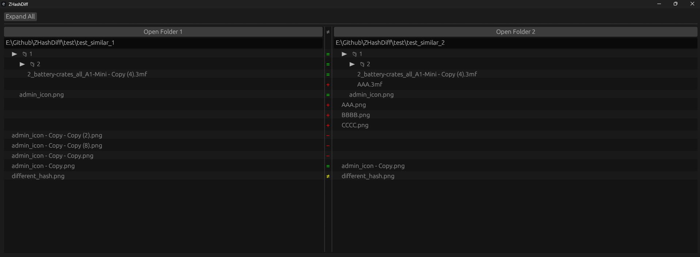
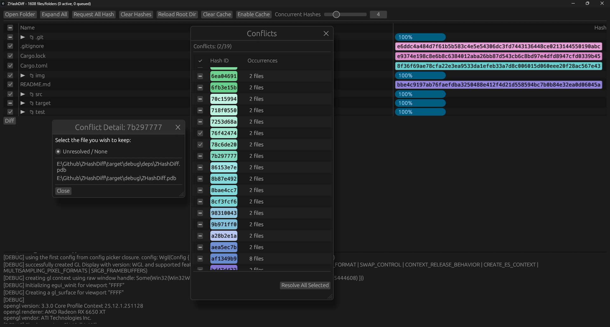

# ZHashDiff-GUI

GUI for zhashdiff crate

# Known bugs
* Opening file $1 and file $2 in quick succession while having file $2 open already will crash.
- Workaround to open not open files at the same time while diffing is occuring.

# Features
* Tree folder diff view
* Detect & remove duplicate files

# Todo
* "cursor" on rows
* ctrl+1/2, alt+up/down move cursor to next diff
* Maybe fixed?? ____ Some PCs egui becomes white after first launch ____ 

## Duplicate file diff:
* conflicts found window, highlight current selection
* Allow restoring of resolved files (maybe mark file names as red?)
